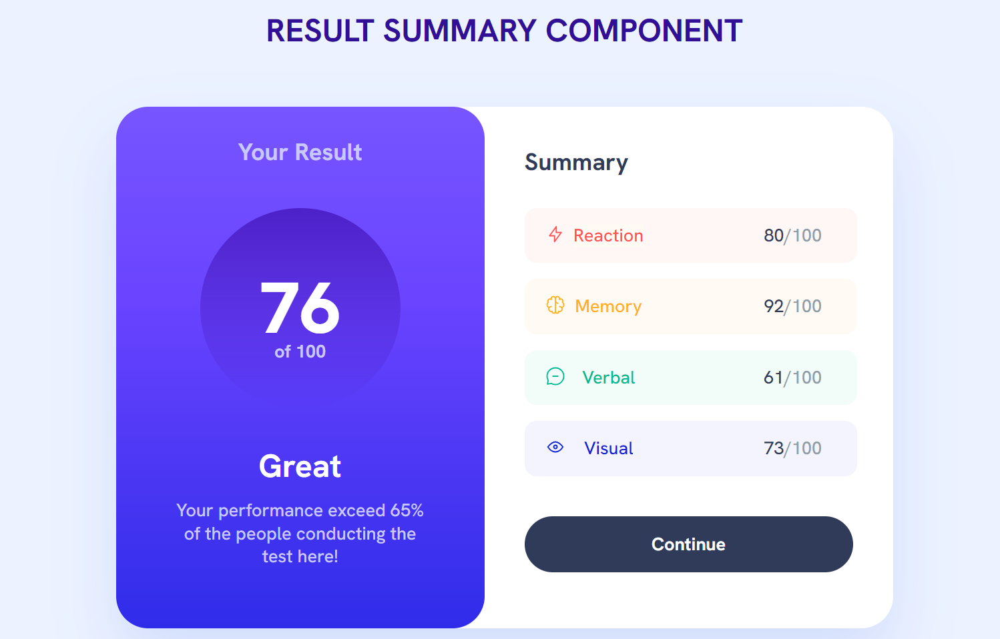

## Welcome! 👋

# Frontend Mentor - Results summary component solution

This is a solution to the [Results summary component challenge on Frontend Mentor](https://www.frontendmentor.io/challenges/results-summary-component-CE_K6s0maV). Frontend Mentor challenges help you improve your coding skills by building realistic projects. 

## Table of contents

- [Overview](#overview)
  - [The challenge](#the-challenge)
  - [Screenshot](#screenshot)
  - [Links](#links)
- [My process](#my-process)
  - [Built with](#built-with)
  - [What I learned](#what-i-learned)
  - [Useful resources](#useful-resources)
- [Author](#author)
- [Acknowledgments](#acknowledgments)

## Overview

### The challenge

Users should be able to:

- View the optimal layout for the interface depending on their device's screen size
- See hover and focus states for all interactive elements on the page
- **Bonus**: Use the local JSON data to dynamically populate the content

### Screenshot



### Links

- Solution URL: [Add solution URL here](https://your-solution-url.com)
- Live Site URL: [Add live site URL here](https://your-live-site-url.com)

## My process

### Built with

- Semantic HTML5 markup
- CSS custom properties
- Flexbox
- CSS Grid
- Mobile-first workflow

### What I learned

From the challenge I learnt 2 things:
1. CSS flex-group. 
CSS Flex Groups, also known as Flexbox, is a layout model that allows you to create complex layouts with ease. It provides a flexible way to distribute space and align items within a container, making it a powerful tool for responsive web design. A flex container is an HTML element that holds a group of flex items. To create a flex container, you need to apply the `display: flex;` property to it. This property establishes a new flex formatting context for its children.

```css
.flex-group{
    display: flex;
}
```

2. CSS grid-auto-flow.
A CSS property used in grid layouts to determine how grid items are automatically placed within a grid container when there is more content than explicitly defined grid tracks. This property offers three main values: row, column, and dense. When set to row, new items are placed in rows, stacking vertically. When set to column, they are placed in columns, stacking horizontally. The dense value is particularly useful; it attempts to fill in any gaps left by empty grid cells, optimizing space utilization. By using grid-auto-flow, you can control the flow of content in your grid layout, creating dynamic and flexible designs without specifying exact placement for every item.
```css
.grid-flow{
    display: grid;
    align-content: start;
    gap: 1rem;
}
```

### Useful resources

- [Example resource 1](https://www.w3schools.com/css/css3_flexbox.asp) - This helped me with the CSS flex-group issue.
- [Example resource 2](https://developer.mozilla.org/en-US/docs/Web/CSS/grid-auto-flow) - This is an amazing article which helped me with the CSS grid-auto-flow issue. 

## Author

- Website - [Irene Nyatichi](https://irenenyatichiportfolio.netlify.app/)
- Frontend Mentor - [@irenenyatichi](https://www.frontendmentor.io/profile/irenenyatichi)
- Twitter - [@Me_Tichi](https://www.twitter.com/Me_Tichi)
- Github - [@irenenyatichi](https://github.com/irenenyatichi)
- LinkedIn - [@IreneNyatichi](https://www.linkedin.com/in/irene-nyatichi/)

## Acknowledgments

I'd really like to appreciate Frontend Mentor for this challenge as I was able to learn something new from this challenge.